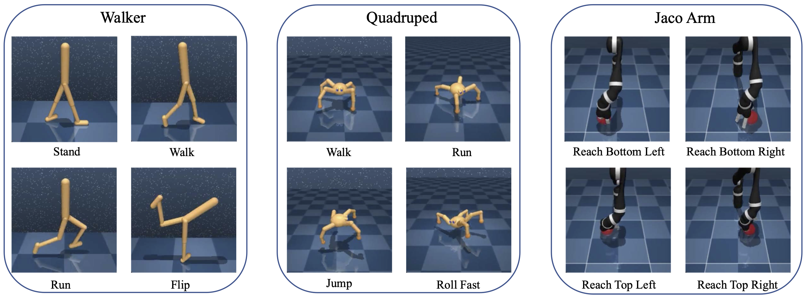

# Pessimistic Value Iteration for Multi-Task Data Sharing 

This repo contains a PyTorch implementation and the datasets for our paper titled "Pessimistic Value Iteration for Multi-Task Data Sharing in Offline Reinforcement Learning" published at *Artificial Intelligence* Journal. This is the paper [Link](https://www.sciencedirect.com/science/article/pii/S0004370223001947). 

## Datasets

We collect a Multi-Task Offline [Dataset](http://alchemist.wang-research.northwestern.edu/dataset/) based on DeepMind Control Suite (DMC).
- Download the [Dataset](http://alchemist.wang-research.northwestern.edu/dataset/) to `./collect` before you start training. 
- The users can collect new datasets based on `collect_daeta.py`. The supported tasks
include standard tasks from DMC and custom tasks from  `./custom_dmc_tasks/`

Our dataset contains 3 domains with 4 tasks per domain, resulting in 12 tasks in total.

| Domain | Available task names |
|---|---|
| Walker | `walker_stand`, `walker_walk`, `walker_run`, `walker_flip` |
| Quadruped | `quadruped_jump`, `quadruped_roll_fast` | `quadruped_walk` | `quadruped_run` |
| Jaco Arm | `jaco_reach_top_left`, `jaco_reach_top_right`, `jaco_reach_bottom_left`, `jaco_reach_bottom_right` |




For each task, we run `TD3` to collect five types of datasets, including:
- `random` data generated by a random agent.
- `medium` data generated by a medium-level TD3 agent.
- `medium-replay` data that collects all experiences in training a medium-level TD3 agent.
- `medium-expert` data that collects all experiences in training an expert-level TD3 agent.
- `expert` data generated by an expert-level TD3 agent.


## Prerequisites

Install [MuJoCo](http://www.mujoco.org/):

* Download MuJoCo binaries [here](https://mujoco.org/download).
* Unzip the downloaded archive into `~/.mujoco/`.
* Append the MuJoCo subdirectory bin path into the env variable `LD_LIBRARY_PATH`.

Install the following libraries:
```sh
sudo apt update
sudo apt install libosmesa6-dev libgl1-mesa-glx libglfw3 unzip
```

Install dependencies:
```sh
conda env create -f conda_env.yml
conda activate utds
```

## Algorithms

We provide several algorithms to train the *single-agent* and *multi-task data-sharing agent*. 

- For single-agent training, we provide the following algorithms. 

| Algorithm | Name | Paper |
|---|---|---|
| Behavior Cloning | `bc` |  [paper](https://arxiv.org/abs/1805.01954)|
| CQL | `cql` |  [paper](https://proceedings.neurips.cc/paper/2020/file/0d2b2061826a5df3221116a5085a6052-Paper.pdf)|
| TD3-BC | `td3_bc` |  [paper](https://proceedings.neurips.cc/paper/2021/hash/a8166da05c5a094f7dc03724b41886e5-Abstract.html)|
| CRR | `crr` |  [paper](http://proceedings.neurips.cc/paper/2020/file/588cb956d6bbe67078f29f8de420a13d-Paper.pdf)|
| PBRL | `ddpg` |  [paper](https://openreview.net/forum?id=Y4cs1Z3HnqL)|
 
- For multi-task data sharing, we support the following algorithms.


| Algorithm | Name | Paper |
|---|---|---|
| Direct Sharing | `cql` |  [paper](https://proceedings.neurips.cc/paper/2020/file/0d2b2061826a5df3221116a5085a6052-Paper.pdf)|
| CDS | `cql_cds` |  [paper](https://proceedings.neurips.cc/paper/2021/hash/5fd2c06f558321eff612bbbe455f6fbd-Abstract.html)|
| Unlabeled-CDS | `cql_cdsz` |  [paper](https://proceedings.mlr.press/v162/yu22c/yu22c.pdf)|
| UTDS | `pbrl` |our paper|


## Training

#### Train CDS

Train the CDS agent in `quadruped_jump (random)` task with data sharing from `quadruped_roll_fast (replay)` dataset, run
```
python train_offline_cds.py task=quadruped_jump "+share_task=[quadruped_jump, quadruped_roll_fast]" "+data_type=[random, replay]" 
```

#### Train UTDS 

Train the CDS agent in `quadruped_jump (random)` task with data sharing from `quadruped_roll_fast (replay)` dataset, run
```
python train_offline_share.py task=quadruped_jump "+share_task=[quadruped_jump, quadruped_roll_fast]" "+data_type=[random, replay]" 
```

We support wandb by setting `wandb: True` in `config*.yaml` file.

## Citation
```
@article{UTDS2023,
title = {Pessimistic Value Iteration for Multi-Task Data Sharing in Offline Reinforcement Learning},
journal = {Artificial Intelligence},
author = {Chenjia Bai and Lingxiao Wang and Jianye Hao and Zhuoran Yang and Bin Zhao and Zhen Wang and Xuelong Li},
pages = {104048},
year = {2023},
issn = {0004-3702},
doi = {https://doi.org/10.1016/j.artint.2023.104048},
url = {https://www.sciencedirect.com/science/article/pii/S0004370223001947},
}
```

## License
MIT license
